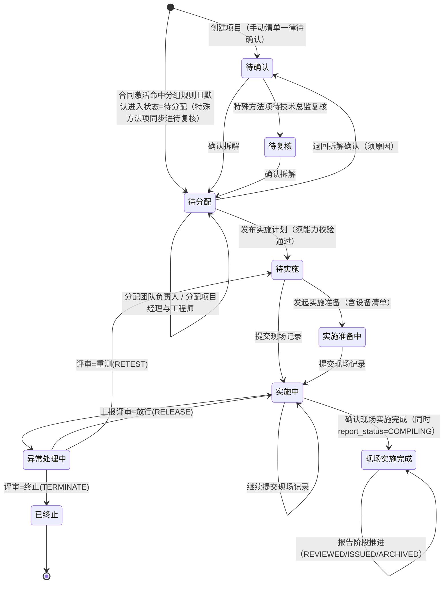

# 项目管理系统 · 业务模型（状态机 / 业务规则 / 关键不变量）

> 版本：**v2 —— 业务口径已裁定（裁定人：架构/测试侧，依据见 §6）**
> 日期：2026-09-13
> 来源说明：**本文不是从需求文档整理的，而是从实现代码 + 已跑通的端到端走查中还原的**。
> 证据标记：**【事实】**=代码/运行时已验证；**【推断】**=由代码行为归纳；**【裁定】**=本方案已按 §6 定下的默认值，可被推翻。
> 你给的模板中【核心业务流程】一栏为空（留的是示例"下单→支付→回调"）。你已授权由我裁定口径，故 §6 是**已生效的决策记录**，§9 是基于这些裁定的缺陷分级。任何裁定都可被推翻，推翻时请连带复核 §9。

---

## 0. 一句话概括

项目管理系统围绕**服务项**推进：合同激活产生项目与服务项 → 确认拆解 → 分配团队 → 发布实施计划 → 发起实施准备（含设备）→ 现场执行 → 确认完成 → 报告编制/审核/签发/归档。
**项目状态不是被"设置"的，而是由全部服务项的状态派生出来的**（见 §3）。

---

## 1. 三个并行状态维度

| 维度 | 载体 | 驱动方式 | 取值 |
| --- | --- | --- | --- |
| **服务项状态** | `pm_service_item.status` | **事件驱动**，每个事件有前置条件 | 待确认 / 待复核 / 待分配 / 待实施 / 实施准备中 / 实施中 / 异常处理中 / 现场实施完成 / 已终止 |
| **报告状态** | `pm_service_item.report_status` | 单向递增链 | NONE / COMPILING / REVIEWED / ISSUED / ARCHIVED |
| **项目状态** | `pm_project.status` | **派生态**（读时计算），不接受业务直接写入 | 9 个线性节点 + 补充协议处理中 + 已终止 |

现状说明【事实】：项目状态与进度都是**读时派生**；创建项目时服务端强制覆盖客户端传入的 `status`/`progress`/`supplement_status`。

---

## 2. 服务项状态机



### 2.1 事件 → 前置条件 → 目标状态（全部【事实】）

| 事件 | 前置条件 | 目标状态 | 副作用 |
| --- | --- | --- | --- |
| `TEAM_ASSIGNED` | status = 待分配 | 不变（待分配） | 写入 `team_lead_id` |
| `EXECUTION_TEAM_ASSIGNED` | status = 待分配 **且 `team_lead_id` 非空** | 不变（待分配） | 写入项目经理、工程师、所需能力码、能力校验结论 |
| `DECOMPOSITION_RETURNED` | status = 待分配；必须填写退回原因；需 `project.decomposition.manage` | **待确认** | 清空全部责任分配、设备选择、能力校验及特殊方法复核结果；事件保留原责任链 |
| `TEAM_ASSIGNMENT_REVOKED` | status = 待分配 **且 `team_lead_id` 非空**；必须填写撤销原因 | 不变（待分配） | 清空团队负责人、执行团队、能力校验及尚未使用的设备选择；事件保留原责任链 |
| `EXECUTION_ASSIGNMENT_REVOKED` | status = 待分配 **且团队负责人、项目经理均非空**；必须填写撤销原因 | 不变（待分配） | 清空项目经理、工程师、能力校验及尚未使用的设备选择；保留团队负责人 |
| `IMPLEMENTATION_PLAN_REVOKED` | status = 待实施；必须填写撤销原因 | **待分配** | 清空当前有效计划快照；保留责任分配、能力结论和全部历史事件 |
| `PREPARATION_REVOKED` | status = 实施准备中；必须填写撤销原因 | **待实施** | 清空当前设备清单并释放设备预约；计划及设备历史留在事件流 |
| `ROLLBACK_REQUESTED` | 现场实施中可申请回到实施准备；报告编制中/已审核可申请返工 | 不变 | 仅创建不可变申请事件，不删除证据 |
| `ROLLBACK_APPROVED` | 申请存在且未被审批；技术总监或系统管理员批准 | 现场→**实施准备中**；报告→**实施中** | 现场/报告原始事件保留；报告返工仅允许未签发、未归档阶段 |
| `IMPLEMENTATION_PLANNED` | status = 待分配；`project_manager_id` 非空；`conflict_status = PASSED`；若是特殊方法则 `tech_review_status = APPROVED`；渗透测试须填专项计划 | **待实施** | 写入计划起止、实施计划、人员清单 |
| `PREPARATION_STARTED` | status = 待实施 | **实施准备中** | 写入设备清单（含使用时段） |
| `FIELD_RECORD_SUBMITTED` | status ∈ {待实施, 实施准备中, 实施中} | **实施中** | 现场记录 |
| `FIELD_COMPLETED` | status = 实施中 | **现场实施完成** | **`report_status` 自动置 COMPILING** |
| `DEVIATION_REPORTED` | status = 实施中 | **异常处理中** | 偏离记录 |
| `DEVIATION_REVIEWED` | status = 异常处理中；决定 ∈ {放行, 重测, 终止} | 放行→**实施中**；重测→**待实施**；终止→**已终止** | 评审意见 |
| `SPECIAL_METHOD_REVIEWED` | `special = 是`；决定 ∈ {APPROVED, REJECTED}；当前复核态 ∈ {PENDING, REJECTED} | 不变 | `tech_review_status` |
| `REPORT_STATUS_UPDATED` | status = 现场实施完成；目标阶段合法；**且严格大于当前阶段** | 不变 | `report_status` + 复核时间/人 |
| `EQUIPMENT_RETURNED` | status ∉ {待确认, 待复核, 待分配, **已终止**} | 不变 | 标记设备归还 |
| 其他未知事件 | 除白名单类"仅留痕事件"外一律拒绝 | — | — |

### 2.2 两个非事件驱动的转移（【事实】）

1. **确认拆解**（独立事务，非事件）：把项目内 status ∈ {待确认, 待复核, 待分配} 的服务项置为 **待分配**；若项目已无待确认/待复核项，则把项目 `supplement_status` 置回 **NONE**（即退出补充协议分支）。副作用：特殊方法项置 `tech_review_status = PENDING` 等待技术总监复核。
2. **拆解调整**（项目级事件 `DECOMPOSITION_ADJUSTED`）：**替换该项目全部服务项**，并把项目置为 **补充协议处理中**（`supplement_status = REQUIRED`）。

---

## 3. 项目状态派生规则

`项目状态 = f(全部服务项状态, 服务项报告状态, supplement_status, 已存储状态)`

项目访问权限先决定主体能否查看项目；项目一旦可见，状态、进度和风险仍从该项目**全部**服务项派生，不能按当前角色可见的服务项子集计算。团队负责人、项目经理、实施工程师和渗透测试工程师属于执行责任角色，即使平台下发 `APPLICATION / ENVIRONMENT / TENANT` 范围，也只能读取 `team_lead_id / project_manager_id / engineer_ids` 中包含自己的服务项及其事件；业务管理员、系统管理员和治理角色继续按平台范围查看。

任务分配候选人的唯一业务来源是 `pm_capability` 中当前启用、有效期覆盖当天、`identity_status=ACTIVE` 且已关联平台 `user_id` 的 `PERSON` 档案。基础平台人员目录仅用于创建资质档案和身份复核，不能绕过人员资质库直接进入负责人或工程师下拉；指派落库统一保存平台 `user_id`，资质编号仅用于展示和审计。

**判定优先级（自上而下）**【事实】：

| 优先级 | 条件 | 项目状态 |
| --- | --- | --- |
| 1 | `supplement_status = REQUIRED` | 补充协议处理中 |
| 2 | 没有服务项 | 回退到已存储状态；为空则「待拆解确认」 |
| 3 | 全部服务项已终止 | 已终止 |
| 4 | 否则 | **取「最滞后」的非终止服务项所处阶段** |

**服务项 → 阶段等级（rank）映射**【事实】：

| 服务项状态 | rank |
| --- | --- |
| 待确认 / 待复核 | 0 |
| 待分配 | 1 |
| 待实施 | 2 |
| 实施准备中 | 3 |
| 实施中 | 4 |
| 异常处理中 | 5 |
| 现场实施完成 + 报告态 NONE | 6 |
| 现场实施完成 + 报告态 COMPILING/REVIEWED/ISSUED | 7 |
| 现场实施完成 + 报告态 ARCHIVED | 8 |
| **无法识别的状态** | **0（按最滞后处理）** |

**进度派生**【事实】：`进度 = Σ rank ÷ (8 × 非终止服务项数) × 100`；已终止项**既不计分子也不计分母**；全部终止时进度 = 100。

---

## 4. 业务规则清单

### 4.1 状态与流转

| # | 规则 | 来源 |
| --- | --- | --- |
| R1 | 项目状态是派生的，客户端不能直接设置 | 【事实】 |
| R2 | 发布实施计划前必须完成"能力校验通过"，否则拒绝并给出可执行原因 | 【事实】 |
| R3 | 执行分配（项目经理+工程师）之前必须已有团队负责人 | 【事实】 |
| R4 | 特殊方法服务项必须先通过技术总监复核，才能发布实施计划 | 【事实】 |
| R5 | 报告阶段只能向后推进，不能回退或原地推进 | 【事实】 |
| R6 | 现场实施完成时自动进入报告编制，无需额外动作 | 【事实】 |
| R7 | 已终止是终态：不能回退、不能在该状态归还设备 | 【事实】 |
| R8 | 拆解调整会一次性替换项目全部服务项（不是增量），并进入补充协议处理中 | 【事实】 |
| R9 | 拆解全部确认后项目自动退出补充协议分支 | 【事实】 |
| R10 | **合同拆解规则配置 v2（原型 PG-CFG-01）**：分组维度可配（默认「批次 + 检测类别」= 1 个服务项，覆盖规则可到三维）、初始状态取「默认进入状态」、检测类别域提供默认体系要求与特殊方法口径。**分组规则未命中 → 按「分组规则缺失时」处理，默认标记「待人工确认」并通知业务管理员**（不再自动放行）；手动创建的项目一律待确认 | 【事实】 |

### 4.2 权限（与授权目录 `catalog_version 5` 对齐，【事实】）

| 动作 | 权限码 | 持有角色 |
| --- | --- | --- |
| 确认拆解 | `service_item.confirm` | 业务管理员（**项目经理不持有**） |
| 分配团队负责人 | `project.team.assign` | 业务管理员 |
| 分配项目经理与工程师 | `project.execution.assign` | 团队负责人 |
| 撤销团队负责人分配（同时撤销下游执行团队） | `project.team.revoke` | 业务管理员（系统管理员可代办） |
| 撤销执行团队分配 | `project.execution.revoke` | 团队负责人（系统管理员可代办） |
| 撤销实施计划、实施准备 | `project.implementation.revoke` | 项目经理（系统管理员可代办） |
| 申请现场/报告回退 | `project.rollback.request` | 项目经理、团队负责人（系统管理员可代办） |
| 审批现场/报告回退 | `project.rollback.approve` | 技术总监、系统管理员 |
| 发布实施计划 / 发起实施准备 | `project.implementation.plan` | 项目经理 |
| 提交现场记录 | `project.field.execute` | 工程师、渗透测试工程师 |
| 上报偏离 | `project.deviation.report` | 工程师、渗透测试工程师 |
| 评审偏离 | `project.deviation.review` | 团队负责人、技术总监 |
| 确认现场实施完成 | `project.field.complete` | 项目经理 |
| 报告编制/审核/签发 | `project.report.manage` | 项目经理、质量管理员 |
| 报告归档 | `project.report.archive` | 技术总监、质量管理员 |
| 特殊方法复核 | `project.special_method.review` | 技术总监 |
| 拆解调整 | `project.decomposition.manage` | 业务管理员 |
| 资质与能力维护 | `project.resource.manage` | 质量管理员、设备管理员、项目系统管理员 |
| 设备维护 | `project.device.manage` | 设备管理员 |
| 规则与配置 | `project_rule.manage` | 质量管理员 |
| 字段级脱敏 | `project.field_permission.manage` | 项目系统管理员 |

> **2026-09-14 角色权限核对结论**：按「权限 → 模块」逐项核对后修正三处不一致——设备管理员补 `qualifications`（持有 `project.resource.manage` 却无维护入口）、质量管理员补 `standards`（六类配置中唯一缺失的一类）、渗透测试工程师去掉 `planning`（不持有 `project.implementation.plan`，只能填不能提交）。

**当前角色集合**：项目系统管理员、平台系统管理员、业务管理员、团队负责人、技术总监、项目经理、实施工程师、渗透测试工程师、质量管理员、设备管理员。

### 4.2.1 合同拆解规则配置（原型 PG-CFG-01）

合同生效后「合同服务清单 → 项目服务项」的转换由三块配置决定，配置页签「系统配置 · 合同拆解规则」：

| 配置块 | 作用 | 关键口径 |
| --- | --- | --- |
| ① 默认分组规则 | 决定「几个清单行合成为 1 个服务项」与初始状态 | 分组维度 1（批次/场所/客户/合同）× 维度 2（检测类别/体系要求/方法类型）[, 维度 3 可选]；默认进入状态（待确认/待分配）；是否生成技术要求摘要及其可编辑性；范围变更检测 |
| ② 检测类别（服务类型）域 | 服务类型的公共主数据 | 默认体系要求（等保 2.0 / ISO 9001 / ISO 27001…）、必备资质（默认，展示用）、必检能力码（默认，逗号分隔；落到服务项供分配时做能力校验）、是否特殊方法（否/可标记/必为特殊方法）；支持 CSV 导出/导入 |
| ③ 覆盖规则 | 按客户/合同/服务项数覆盖默认规则 | 匹配条件为 AND 语义，命中多条时取优先级最小的一条；只覆盖显式给出的设置 |

拆解流程（与「流程图-02-拆解流程」一致）：

1. 合同生效 → 读取合同服务清单；
2. **分组规则是否命中**：命中 → 按分组维度自动生成服务项；未命中 → 按「分组规则缺失时」处理（默认标记「待人工确认」并通知业务管理员）；
3. 服务项初始状态 = 配置的默认进入状态（默认待确认）；检测类别域「必为特殊方法」会强制渗透测试并进入技术总监复核窗口；
4. 业务管理员核对（编辑技术要求摘要 / 系统名称补充）→ 若**范围变更**（拆解范围与合同清单不一致）→ 触发补充协议流程并等待合同回写；
5. 确认拆解 → 服务项进入待分配。

> 检测类别域初始 17 类：两个原型版本都只渲染 17 行（页脚标注"共 19 类"），以可见行为准落库，其余由管理员新增。
>
> 待集成项：原型覆盖规则的匹配条件还用到「客户行业」「客户标签」等 CRM 字段，项目系统自身数据里没有；
> 当前只支持客户名称包含 / 合同号包含 / 合同服务项数 / 检测类别集合，CRM 字段留待跨系统集成。
> 检测类别域的「必备资质」是资质名称（如 CISP-PTE），而能力校验比对能力码，两者编码体系不同，
> 因此能力校验改由「必检能力码」驱动（留空即不额外校验，渗透测试仍自动追加 PENETRATION_TEST）。

### 4.3 资源、能力与设备

| # | 规则 | 来源 |
| --- | --- | --- |
| R11 | 分配工程师时按其**当前有效**的资质/能力记录校验所需能力码；过期记录不参与校验 | 【事实】 |
| R12 | 特殊方法（渗透测试）会额外要求 `PENETRATION_TEST` 能力码 | 【事实】 |
| R13 | 同一台设备在同一时段只能被一个服务项占用；被占用/仅在公司使用/不在公司的设备不可选 | 【事实】 |
| R14 | 设备归还只能作用于已进入交付阶段的服务项 | 【事实】 |
| R15 | 实施计划与实施准备中的"使用时段"必须成对填写且结束不早于开始 | 【事实】 |

### 4.4 派生口径与指标

| # | 规则 | 来源 |
| --- | --- | --- |
| R16 | 风险项目 = 项目状态 ∈ {异常处理中, 已终止} | 【事实】 |
| R17 | "已完成"计数 = 项目状态恰为「已完成」的数量 | 【事实】 |
| R18 | 进度排除已终止项（分子分母都不计） | 【事实】 |
| R19 | 无服务项的项目回退到已存储状态，不判为「待拆解确认」 | 【事实】 |

### 4.5 时间与提醒

| # | 规则 | 来源 |
| --- | --- | --- |
| R20 | SLA 分两个口径：①计划完成时间已过（固定口径）②服务项停留在规则状态超过时限 | 【事实】 |
| R21 | 时间统一按 UTC 计算（`UTC_TIMESTAMP()`） | 【事实】 |
| R22 | 系统内**没有任何定时扫描任务**，超期/到期只能被动查询 | 【事实】 |

### 4.6 审计与通知

| # | 规则 | 来源 |
| --- | --- | --- |
| R23 | 关键写操作进入交付事件流（`pm_delivery_event`）留痕 | 【事实】 |
| R24 | 通知由平台统一收件箱承担；项目系统侧配置默认关闭 | 【事实】 |
| R25 | 子系统只从平台读取身份与授权上下文，不维护本地账号 | 【事实】 |

---

## 5. 关键不变量

> 说明：不变量是"任何时候都必须成立"的断言。下面给出**违反后的直接后果**，便于判断优先级。

| # | 不变量 | 违反后果 | 现状 |
| --- | --- | --- | --- |
| **I1** | 项目状态唯一，且必属 12 个节点之一 | 看板/筛选/风险计数互相矛盾 | 由派生函数保证 |
| **I2** | 只要有非终止服务项停在早期阶段，项目不得显示为更晚期（"最滞后"原则） | 进度与状态口径相反 | 由 rank 最小值保证 |
| **I3** | 报告阶段严格单向：NONE→COMPILING→REVIEWED→ISSUED→ARCHIVED | 报告可被回退，签发失去意义 | 由 rank 比较保证 |
| **I4** | 已终止是终态，不可回退、不可再变更设备 | 终态数据被改写，历史失真 | 由事件前置条件保证 |
| **I5** | 发布实施计划的前提是"能力校验已通过" | 未持证人员被派现场 | 由前置规则保证 |
| **I6** | 执行分配的前提是"已有团队负责人" | 责任链断裂 | 由前置规则保证 |
| **I7** | 特殊方法必须复核通过才能开工 | 未授权的攻击性测试被执行 | 由前置规则保证 |
| **I8** | 同一设备同一时段只归属一个服务项 | 设备被重复派出 | 由占用校验保证（边界语义待确认，见 §6） |
| **I9** | 人员分配时必须具备启用资质、有效平台身份和用户关联；人员不受日期有效期限制 | 派遣已停用、离职或未关联身份的人员 | 由分配时点校验保证；日期限制仅用于设备检定 |
| **I10** | 项目状态与进度不接受客户端写入 | 客户端可伪造完成状态 | 由服务端强制覆盖保证 |
| **I11** | 一切数据访问限定在租户内 | 跨租户数据泄漏 | 由查询带 `tenant_id` 保证 |
| **I12** | 项目 `services` 计数 = 该项目服务项实际条数 | 列表展示与实际不符 | 在拆解/激活时更新，**是否全覆盖待确认** |
| **I13** | 服务项状态只能通过事件流转，不能任意改写 | 状态机被绕过 | 写路径统一走事件应用 |

### 5.1 不变量回归基线（已建立）

上面 13 条不变量已落地为可运行的回归断言，位于
`internal/httpapi/invariants_e2e_test.go`（真实路由 + 真实 MySQL，隔离租户，跑完自清理）：

| 不变量 | 对应用例 | 断言内容 | 基线结果（2026-09-13） |
| --- | --- | --- | --- |
| I1 / I2 | `TestInvariantI1I2ProjectStatusDerivation` | 派生状态取值合法，且取「最滞后」项 | PASS |
| I3 | `TestInvariantI3ReportChainIsMonotonic` | 已归档后回退被拒（422） | PASS |
| I4 | `TestInvariantI4TerminatedIsFinal` | 已终止项归还设备被拒（422） | PASS |
| I5 | `TestInvariantI5PlanRequiresPassedCapabilityCheck` | 能力校验未通过时发布计划被拒（409） | PASS |
| I6 | `TestInvariantI6ExecutionAssignRequiresTeamLead` | 无团队负责人时执行分配被拒（422） | PASS |
| I7 | `TestInvariantI7SpecialMethodRequiresReview` | 特殊方法未复核即发布计划被拒（409） | PASS |
| I8 | `TestInvariantI8EquipmentSingleOccupancy` | 重叠时段占用同一设备被拒（409 `PM_RESOURCE_CONFLICT`，并点名占用方） | PASS |
| I9 | `TestInvariantI9PersonnelDatesDoNotBlockAssignment` | 人员资质日期已过仍可参与校验，启停和身份状态继续生效 | PASS |
| I10 | `TestInvariantI10DerivedStateNotClientWritable` | 客户端传入的 status/progress/supplement_status 被服务端覆盖 | PASS |
| I11 | `TestInvariantI11TenantIsolation` | 跨租户读取详情/列表均不可见 | PASS |
| I12 | `TestInvariantI12ServiceCountMatchesItems` | 拆解调整后 `services` 与实际条数一致 | PASS |

**结论：13 条不变量当前全部成立**（I13 属结构性约束，由写路径统一走事件应用保证，未单独用例）。

> 基线说明：用例每次以隔离租户运行并自清理，可直接作为验收门禁；若后续改动导致任一不变量被破坏，用例会立即失败。

### 5.2 一条健壮性观察（非缺陷）

`updateImplPlanEquipment` 与 `markEquipmentReturned` 都用 `UPDATE ... WHERE tenant_id + service_item_id` 写计划行：
**当计划行不存在时，影响 0 行且不报错**（静默无操作）。
正常链路不会触发（实施准备的前置要求已发布实施计划），但若未来新增"直接改状态"的旁路入口，设备清单会静默丢失。建议这两处补 `RowsAffected` 校验。

---

## 6. 决策记录（已裁定）

> 裁定原则：能被代码/运行时证据支撑的**直接定**；属于商业口径的，选**与系统既有语义最自洽**的默认值，并标注可逆性。

### 6.1 模型骨架（原 Q1–Q5）

| # | 裁定 | 依据 | 可逆性 |
| --- | --- | --- | --- |
| Q1 | **以本文 §1–§3 的 as-built 模型为事实基线**。若与业务意图不符，按"变更项"处理，不按 Bug 处理 | 无需求文档时，唯一可验证的真相是代码行为 + 运行时证据 | 高 |
| Q2 | **合同激活由合同系统发起、本系统接收建档；手工创建作为业务补救入口**，两条路径都保留 | `POST /contracts/activate`（机器身份）与 `POST /projects`（业务管理员）并存且各自授权 | 中 |
| Q3 | **"确认拆解"是业务确认，不是审批链**，不引入多级审批 | 系统内不存在审批实例/任务表；为一次性批量确认 | 中 |
| Q4 | **异常处理保持三个出口（放行/重测/终止）**，不新增"挂起/转他人" | 三出口已构成闭集：继续 / 返工 / 放弃 | 中 |
| Q5 | **已终止保持硬终态、不可恢复**；需要"恢复"时走**拆解调整**重建服务项 | 终态可逆会让风险口径、进度、审计全部不稳定；拆解调整是已有的、留痕的、受权限控制的合规路径 | 高 |

### 6.2 口径裁定（原 Q6–Q12）

| # | 裁定 | 理由 | 对缺陷判定的影响 |
| --- | --- | --- | --- |
| Q6 | **部分终止的项目：状态仍为「已完成」，但计入风险**。风险口径扩展为「状态 ∈ {异常处理中, 已终止} **或存在已终止服务项**」 | "剩余工作确实做完了"（状态）与"有被砍掉的部分"（风险）是两件事，应分别表达；改计数不改状态，改动最小 | PM-STATUS-02 → **应修** |
| Q7 | **全部终止时进度改为 0**，不再返回 100 | 前端把 100% 与"成功完成"视觉绑定（绿色 KPI、满格进度条）；"放弃"不该显示为完成。已完成计数本就按状态统计（R17），不受影响 | PM-PROG-01 → **应修** |
| Q8 | **资质"有效期至"含当日**（到期日当天仍可用，次日 00:00 失效） | 中文语境"至 X 日"含当日；"今天到期今天不能派人"不合业务直觉 | PM-DATE-01 → **应修** |
| Q9 | **设备使用时段两端都含当日**，故相邻时段（1–5 日 / 5–10 日）**算冲突** | 与 Q8 保持同一区间语义，避免系统内并存两种口径 | PM-EQ-01 → **应修** |
| Q10 | **停留时长必须按"状态变更时刻"计**，不得复用行 `updated_at` | SLA 定义是"停留在该状态的时长"；改备注等无关更新不应重置计时 | 改变 PM-SLA-01 的**修复方式**（见 §9.1） |
| Q11 | **存储与计算统一 UTC（保持现状），展示按浏览器本地时区** | 系统已统一 UTC，改动风险大于收益 | 不产生缺陷 |
| Q12 | **本系统不涉及金额**；金额与结算归结算子系统 | 本系统状态机与字段中无金额参与 | 明确系统边界 |

### 6.3 提醒与通知（原 Q13–Q15）

| # | 裁定 |
| --- | --- |
| Q13 | **最小可用提醒集合 = 8 个节点**：①拆解确认完成 → 团队负责人/业务管理员；②指派（团队负责人/项目经理/工程师）→ **被指派人**；③实施计划发布 → 被指派人；④实施准备发起 → 项目经理+工程师；⑤偏差上报 → 团队负责人/技术总监；⑥偏差评审完成 → **上报人**；⑦报告阶段推进 → 下一阶段责任人；⑧SLA 超期 → 项目经理+团队负责人。**原则：只对"需要某人去做事"的节点发提醒**，不是每个状态变更都发 |
| Q14 | **提前提醒必须覆盖"计划完成时间未到、但已临近超时"的服务项**，否则该功能没有业务意义 |
| Q15 | **收件人优先级：被指派人 > 角色组**。提醒应发给"需要行动的人"，而不是操作者 |

### 6.4 并发与协作（原 Q16–Q18）

| # | 裁定 | 依据 |
| --- | --- | --- |
| Q16 | **并发保护范围锁定 3 个交叉点**：①待分配/待实施边界——业务管理员（拆解调整）vs 项目经理（发计划）；②待分配——项目经理（发计划）vs 团队负责人（执行分配）；③实施中——工程师（现场记录）vs 项目经理（确认完成） | 由状态机前置条件推得 |
| Q17 | **冲突一律拒绝 + 语义化提示（409）**，不做自动合并；且第一步先做到"能检测、能提示" | 交付类数据自动合并会造成责任不清 |
| Q18 | **设备抢占硬拒绝（先到先得）**，但必须返回占用方信息（谁、哪个服务项、哪个时段）供线下协商 | 设备是有限物理资源，协商不该在系统内做 |

### 6.5 数据现状（原 Q19–Q22）：判定规则由我定，SQL 由你们跑

我无法访问真实环境，因此**不定答案、只定判定规则与后续动作分支**（SQL 见 §7，全部只读）：

| # | 若 > 0 | 若 = 0 |
| --- | --- | --- |
| Q19 映射外状态 | 立即修 rank 兜底，**并**出数据修正方案（否则项目状态持续错误） | 只做防御性改造，降优先级 |
| Q20 带空格状态 | SLA 规则已在静默失效，**立即修** | 只做两侧统一 Trim 的防御 |
| Q21 已有启用 SLA 规则 | SLA 口径问题**已在影响线上**，列最高优先级 | 可按常规排期修复 |
| Q22 卡在补充协议分支 | 这些项目永远显示"补充协议处理中"，需人工核对是否应退出分支 | 无需处理 |

**本地环境实测（供对照）**：Q19=0、Q20=0、Q21=0、Q22=0（服务项总数为 0，本地库为空）——因此这四项**必须在你们的预发/生产环境执行**。

## 7. 只读排查 SQL（不改任何数据）

```sql
-- Q19：映射表外的服务项状态（这些会把项目状态拖回「待拆解确认」）
SELECT status, COUNT(*) AS cnt
FROM pm_service_item
WHERE status NOT IN ('待确认','待复核','待分配','待实施','实施准备中','实施中','异常处理中','现场实施完成','已终止')
GROUP BY status;

-- Q20：状态值带前后空格的记录
SELECT COUNT(*) FROM pm_service_item WHERE status <> TRIM(status);

-- Q21：SLA 规则配置情况
SELECT kind, enabled, COUNT(*) FROM pm_sla GROUP BY kind, enabled;

-- Q22：长期停留在补充协议分支的项目
SELECT id, name, supplement_status, updated_at
FROM pm_project
WHERE supplement_status = 'REQUIRED'
ORDER BY updated_at;

-- 服务项状态分布（用于核对本文 §2 的状态集合是否有遗漏）
SELECT status, COUNT(*) FROM pm_service_item GROUP BY status ORDER BY cnt DESC;

-- 报告状态分布（核对 §3 报告链）
SELECT report_status, COUNT(*) FROM pm_service_item GROUP BY report_status;

-- 项目状态 vs 派生结果抽查：取若干项目，人工比对
SELECT p.id, p.status AS stored_status,
       COUNT(i.id) AS item_count,
       SUM(i.status = '已终止') AS terminated_count
FROM pm_project p LEFT JOIN pm_service_item i ON i.project_id = p.id AND i.tenant_id = p.tenant_id
GROUP BY p.id, p.status LIMIT 20;
```

---

## 8. 复核方式

本文 v2 的裁定已生效，后续复核只需两步：

1. **推翻式复核**：逐条看 §6，凡你不同意的直接标注——推翻一条裁定，就按 §9 里的对应行重新定级（应修 ↔ 设计意图）。
2. **跑 §7 的 SQL**（只读），把 Q19–Q22 四项结果贴回，我按 §6.5 的分支给出优先级调整。

---

## 9. 缺陷分级（基于 §6 裁定的最终结论）

### 9.1 应修（判定为缺陷）

> **进度更新（2026-09-13）**：P0 与 P1 中的可修复项已全部完成（PM-SLA-01/02/03/05、PM-STATUS-01/02、PM-PROG-01、PM-DATE-01、PM-EQ-01、PM-CONC-01、PM-ADJ-01、PM-NOTIFY-01 契约+3 节点）；PM-EVT-01 经核实推翻；仅 **PM-TASK-01** 与 **PM-NOTIFY-01 剩余 5 个节点** 未完成（见对应行）。
> 修复涉及迁移 `000015_project_service_item_status_changed_at.sql`（新增 `status_changed_at` 列并回填）、
> 事件写路径与确认拆解路径写入该列、SLA 候选集与状态口径解耦、计时改用该列且两侧统一 Trim。
> 全仓测试（含不变量基线 11 项、主流程走查、裁决用例）通过。

| 编号 | 缺陷 | 修复方向（按 §6 裁定） |
| --- | --- | --- |
| ✅ **PM-SLA-01** | 状态停留超期判定失真（实测：刚进入状态被判 **2,562,037 小时**） | **不是简单补 `updated_at`**：按 Q10 引入"状态变更时刻"语义（新增 `status_changed_at`，或取交付事件中最近一次状态流转时间），SLA 计时改用它 |
| ✅ **PM-SLA-05** | 提前提醒不可达（候选集只含计划完成已过的项） | 按 Q14 把"状态停留"口径的候选集与"计划完成超期"口径**解耦** |
| ✅ **PM-SLA-02** | 规则状态单侧 Trim，带空格则静默失效 | 两侧统一 Trim，或入库时规范化状态值 |
| ✅ **PM-SLA-03** | 同一服务项占两条 SLA 记录，计数虚高 | 列表保留两行（口径不同），**计数按服务项去重**（`slaOverdueItemCount`） |
| ✅ **PM-STATUS-02** | 部分终止项目计入"已完成"且不计风险 | 按 Q6 扩展风险口径为「或存在已终止服务项」；改为服务端统一派生并随项目 DTO 返回 `risk`，前端不再复刻 |
| ✅ **PM-PROG-01** | 全部终止时进度 = 100% | 按 Q7 改为 0；"存在终止项"由风险口径承载 |
| ✅ **PM-DATE-01** | 历史上人员资质到期日边界错误 | 2026-09-15 规则已调整为人员不受日期限制；日期口径只用于设备检定，并按开始日/截止日覆盖使用窗口 |
| ✅ **PM-EQ-01** | 设备时段边界语义 + 解析失败静默跳过 | 按 Q9 改为闭区间（相邻时段算冲突）；占用数据异常按占用处理并显式报出 |
| ✅ **PM-STATUS-01** | 未知/空状态导致项目状态倒退 | 等级表改为**单一来源**（`serviceItemStatusStages` 派生 rank），杜绝"新增状态忘登记等级"；未知状态仍保守按最滞后处理，但通过看板 `unknown_status_items` 显式暴露 + 服务端告警，不再静默改变项目状态 |
| ✅ **PM-SLA-04** | `PlannedEnd` 解析失败静默忽略 | `computeSlaItems` 返回被跳过数量，`ListSlaOverdue` 在 >0 时打警告，不再让服务项静默消失在 SLA 口径之外 |
| ✅ **PM-ADJ-01** | 拆解调整对话框不显示目标项目 | 对话框副标题显示**目标项目（ID · 名称）**并强调"全部服务项会被替换"，降低误操作风险 |
| ✅ **PM-CONC-01** | 接口不返回版本，客户端无从判断冲突 | 迁移 000016 加 `version`；事件写路径改条件更新 + 版本自增并暴露 `version`；6 个写入口接受 `expected_version`，不符即 **409 `PM_STATE_CONFLICT`**；前端写操作回传版本并在 409 时提示 + 重载 |
| 🟡 **PM-NOTIFY-01** | 通知链路必然失效（scope/endpoint 双错） | **契约 + 3 个节点已完成**：endpoint 改为 `/api/v1/notifications/events`、scope 改为 `CROSS_SYSTEM`、新增"被指派人"提醒（团队负责人 / 项目经理 / 工程师）并在 `applyEvent` 统一发出口；收件人超长过滤（平台会因单个非法收件人丢整条）。已落地节点（7/8）：指派（团队负责人/项目经理/工程师）、实施计划发布（计划人员清单）、实施准备发起、偏差上报、报告阶段推进，以及 **SLA 超期/临近**（由 `ScanSlaNotifications` 主动提醒）。收件人不足时统一回退到服务项当前被指派人。**待办**：偏差评审完成 → 上报人（需要新增按 deviation_id 查上报人的仓储方法）、拆解确认完成（该时点尚无被指派人）；以及 outbox 持久化（当前投递失败仅 Warn，平台不可用时会丢通知） |
| ✅ **PM-TASK-01** | 无定时扫描，超期/到期无主动提醒 | 新增 `Service.ScanSlaNotifications(ctx, tenantID, now)`：按租户边界扫描 SLA 超期/临近项并投递提醒（幂等键＝服务项+口径+UTC 日期，同日不重复打扰，超期用 HIGH 优先级）；新增 `cmd/sla-notifier` 周期任务（`SLA_SCAN_TENANTS` 显式限定租户、`SLA_SCAN_INTERVAL` 默认 15m），已接入镜像与 compose 并实测启动 |
| ✅ **PM-DUP-01** | 同一合同版本重复新建项目报 500「服务暂不可用」 | 唯一键 `uq_pm_project_contract_version` 冲突（MySQL 1062）未在应用层翻译，被 `writeServiceError` 兜底成 500；改为应用层提交前预检 + 仓储层翻译 → **409 `PM_DUPLICATE_PROJECT`**（含已存在项目编号与替代动作：走拆解调整/补充协议）；前端在选择阶段把已有项目的合同标注并置灰 |
| ✅ **PM-SPLIT-02** | 拆解规则模型与原型不符：自由文本「适用范围」表达不了分组维度/检测类别域/覆盖规则，且「存在规则且未命中 → 自动放行到待分配」与原型拆解流程（未命中 → 待人工确认 + 通知业务管理员）相反 | 按原型 PG-CFG-01 重建：三块配置表 + 按配置分组与定状态 + 检测类别域口径 + 覆盖规则优先级 + 范围变更检测勾对；存量自由文本规则按确认结论删除（迁移 000017/000018） |
| ✅ **PM-SPLIT-01** | 手动创建项目后项目直接进入「待分配」，从未出现在服务项拆解确认里 | 根因：手动清单同样套用拆解规则的自动放行（存在启用规则且未命中 → 待分配），而拆解确认页只列待确认/待复核项，被放行的项再也进不去确认流程；确认拆解又是特殊方法项置 `tech_review_status=PENDING` 的唯一入口，因此自动放行的渗透测试项既不能复核（前置 PENDING/REJECTED）也不能发布实施计划（前置 APPROVED），项目永久卡死。修复：手动创建一律「待确认」；自动放行只保留给合同激活/拆解调整，且特殊方法项同步进入复核窗口；两处插入路径补写 `tech_review_status`（此前被丢弃） |
| ❌ **PM-EVT-01（已推翻）** | ~~交付事件无唯一键，重投会二次执行状态机~~ | **经核实不成立**：事件 ID 由本系统本地生成（每次投递都是新 ULID），加唯一键防不住重投；合同重投的真实防线是 `uk_pm_project_contract_version`，命中后返回 `ErrDuplicateContract` 并由同一事务回滚，不落重复事件、不二次执行状态机。**不实施无效果改动** |

### 9.1.1 部署安全网：库结构落后于代码

线上曾出现「业务管理员新建项目提示服务暂不可用」：新代码写入 `pm_service_item.system_standard`，
但目标库没跑该迁移 → `Error 1054 Unknown column` → 接口 500 `PM_INTERNAL_ERROR`，对外只剩一句
"服务暂不可用"，把"部署漏迁移"伪装成业务故障（已在本机用"新代码 + 去掉该列"精确复现）。

处置：

1. 服务端补跑迁移：`docker compose -f compose.yaml --profile project-release run --rm project-migrate`，
   再 `docker compose ... up -d project-api`；
2. 代码侧加安全网（本次已实现）：启动时核对 `pm_schema_migration`，待执行迁移非空则
   打 ERROR 日志列出清单，并让 `/readyz` 返回 503 `migrations_pending`；`/healthz` 保持 200
   但带出 `pending_migrations` 数量；部署脚本的就绪校验改为探 `/readyz`。

### 9.2 判定为设计意图（不修，但需文档化）

| 编号 | 结论 |
| --- | --- |
| PM-PERM-01 | 项目经理不持有 `service_item.confirm` 属**有意的职责分离**（Q3）：项目经理负责执行计划，不负责拆解确认。**需在角色职责/权限矩阵中明确写清** |

### 9.3 优先级依 §6.5 数据结果而定

与 Q19–Q22 相关的项（状态兜底、SLA 依赖、补充协议卡单）按 §6.5 的动作分支处理。

### 9.4 明确不做（防止范围蔓延）

不引入多级审批（Q3）｜不新增异常处理出口（Q4）｜不做"撤销终止"（Q5，改用拆解调整）｜不做冲突自动合并（Q17）｜不改时区模型（Q11）｜本系统不涉金额（Q12）
