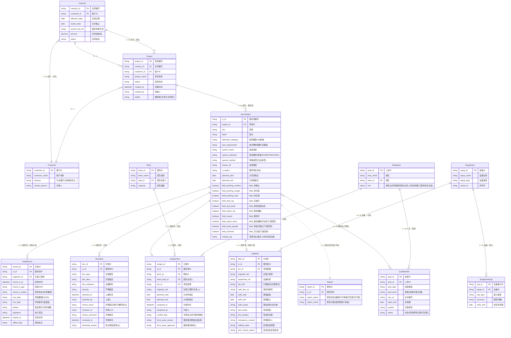

# 项目服务内容管理子系统 · 系统 ER 图 V1.0

> 依据《需求规格说明书 V1.0》第 8 节（数据实体与关键字段）+《页面清单 V1.0》状态机 + Q4 字段独立回传约定 整理
>
> 渲染：在 VSCode / Typora / GitHub / Obsidian 等支持 Mermaid 的 Markdown 工具中可直接渲染 ER 图
>
> 颜色图例：
> - 🔵 **蓝色**：本子系统拥有与维护的实体
> - 🟣 **紫色**：本子系统 + 下游系统通过**独立字段**协同的实体（互不覆盖，Q4）
> - ⚪ **灰色**：外部系统拥有的实体（仅引用，不在本子系统落库）

---

## 一、ER 总览图



---

## 二、实体清单与归属

| # | 实体 | 归属 | 本子系统维护字段 | 关键说明 |
|---|---|---|---|---|
| 1 | **Project 项目** | 🟢 本子系统 | 全字段 | 合同拆解生成的项目主数据 |
| 2 | **ServiceItem 服务项** | 🟢 本子系统 | 全字段 + 7 个独立状态字段 | 状态机载体；`field_xxx` 字段满足 Q4 互不覆盖 |
| 3 | **Assignment 任务分配** | 🟢 本子系统 | 全字段 | 资源下达记录，含冲突标记与强制通过审批 |
| 4 | **ImplPlan 实施计划** | 🟢 本子系统 | 全字段 | 含渗透测试条件子表 |
| 5 | **ImplRecord 实施记录** | 🟢 本子系统 | 全字段 | 现场留痕（GPS/数据/照片/签名） |
| 6 | **Deviation 异常单** | 🟢 本子系统 | 全字段 | 闭环留痕（评审/放行/重测/终止） |
| 7 | **Qualification 资质** | 🟢 本子系统 | 全字段 | 主数据归口：技术总监（Q3） |
| 8 | **EquipmentCap 设备能力** | 🟢 本子系统 | 全字段 | 设备能力主数据 |
| 9 | Contract 合同 | ⚪ 合同管理子系统 | 仅引用 | 通过接口拉取，跨子系统 |
| 10 | Customer 客户 | ⚪ 客户与商机管理 | 仅引用 | 跨子系统 |
| 11 | Employee 人员 | ⚪ 统一认证/IM | 仅引用 `emp_id` | 跨子系统，资质明细在本系统 |
| 12 | Team 团队 | ⚪ 统一认证/主数据 | 仅引用 | 跨子系统 |
| 13 | Equipment 设备 | ⚪ 设备主数据 | 仅引用 | 设备能力明细在本系统 |
| 14 | Report 报告 | 🟣 报告管理子系统 | 引用 `si_id` | 报告管理子系统主导；本系统通过**独立字段**回传 |

---

## 三、核心实体字段详表

### 3.1 Project 项目

| 字段 | 类型 | 必填 | 说明 |
|---|---|---|---|
| project_id | string | ✓ | 项目编号（如 PJ-2026-0823） |
| contract_id | FK | ✓ | 合同编号（引用） |
| customer_id | FK | ✓ | 客户ID（引用） |
| project_name | string | ✓ | 项目名称 |
| status | enum | ✓ | 项目状态（在途/已完成/风险） |
| health | enum | — | 健康度（正常/关注/风险） |
| created_at | datetime | ✓ | 创建时间 |
| created_by | string | ✓ | 创建人（业务管理员） |
| detection_categories | array | ✓ | 检测类别（19 类域） |
| system_standards | array | — | 体系要求（等保/ISO9001/ISO27001） |

### 3.2 ServiceItem 服务项（状态机载体，**最关键实体**）

| 字段 | 类型 | 必填 | 说明 |
|---|---|---|---|
| si_id | string | ✓ | 服务项编号（如 SI-0823-01） |
| project_id | FK | ✓ | 所属项目 |
| site | string | ✓ | 场所（如「北京总部 - 中心机房」） |
| batch | string | ✓ | 批次（第一/二/三批次） |
| detection_category | enum | ✓ | 检测类别（19 类域） |
| tech_requirement | text | ✓ | 技术要求摘要（**默认可编辑**） |
| system_name | string | — | 系统名称（合同未提供则自动填「/」） |
| system_standard | enum | — | 体系要求 |
| special_method | boolean | — | 是否特殊方法（**手动标记**） |
| clause_ref | string | — | 来源条款引用 |
| si_status | enum | ✓ | 服务项主状态（业务侧） |

**独立状态字段（Q4 关键 — 互不覆盖，无权威源冲突）：**

| 字段 | 类型 | 维护方 | 触发 |
|---|---|---|---|
| `field_待确认` | boolean | 本子系统 | 合同拆解自动生成 |
| `field_待分配` | boolean | 本子系统 | 业务员确认后 |
| `field_待实施` | boolean | 本子系统 | 指派完成 |
| `field_实施中` | boolean | 本子系统 | 项目经理发起实施 |
| `field_现场实施完成` | boolean | 本子系统 | 项目经理确认完成 |
| `field_报告编制` | boolean | 本子系统 | 现场完成后自动进入 |
| `field_整改中` | boolean | 本子系统 | 报告编制 ⇄ 整改（必填变更原因） |
| `field_报告编制已完成` | boolean | 报告管理回传 | 报告审核完成 |
| `field_审核已通过` | boolean | 报告管理回传 | 报告签发 |
| `field_已归档` | boolean | 归档管理回传 | 归档完成 |

> 任意字段变更均进入审计日志（操作人/时间/前/后值），满足等保 / ISO 27001 记录控制。

### 3.3 Assignment 任务分配

| 字段 | 类型 | 必填 | 说明 |
|---|---|---|---|
| assign_id | string | ✓ | 分配ID |
| si_id | FK | ✓ | 服务项ID（1:1） |
| team_id | FK | ✓ | 团队 |
| team_lead_id | FK | ✓ | 团队负责人 |
| pm_id | FK | ✓ | 项目经理 |
| engineer_ids | array | ✓ | 实施工程师（可多人） |
| planned_start | date | ✓ | 计划开始日（≥ 合同交付下限） |
| planned_end | date | ✓ | 计划结束日 |
| conflict_flag | enum | — | 冲突标记（无/警告/阻断） |
| force_pass_reason | text | — | 强制通过原因（如阻断时填写） |
| force_pass_approver | FK | — | 强制通过审批人 |

### 3.4 ImplPlan 实施计划

| 字段 | 类型 | 必填 | 说明 |
|---|---|---|---|
| plan_id | string | ✓ | 计划ID |
| si_id | FK | ✓ | 服务项ID（1:1） |
| pm_id | FK | ✓ | 项目经理 |
| engineer_ids | array | ✓ | 实施工程师 |
| equipment_ids | array | ✓ | 设备列表 |
| trip_info | json | — | 行程信息（人员/时间/地点，**内部登记**） |
| auth_doc_no | string | 渗透测试必填 | 授权书编号 |
| auth_start | date | 渗透测试必填 | 授权起始 |
| auth_end | date | 渗透测试必填 | 授权截止 |
| auth_scope | text | 渗透测试必填 | 授权边界（白名单） |
| test_scope | text | 渗透测试必填 | 测试范围 |
| test_window | string | 渗透测试必填 | 测试时间窗 |
| emergency_contact | string | — | 紧急联系人 |
| rollback_plan | text | — | 应急回滚预案 |
| tech_review_status | enum | 特殊方法必填 | 技术总监复核状态（待审/通过/驳回） |

### 3.5 ImplRecord 实施记录

| 字段 | 类型 | 必填 | 说明 |
|---|---|---|---|
| record_id | string | ✓ | 记录ID |
| si_id | FK | ✓ | 服务项ID（1:N） |
| engineer_id | FK | ✓ | 实施工程师 |
| check_in_at | datetime | ✓ | 签到时间 |
| check_in_gps | string | — | 签到 GPS（经纬度） |
| check_in_status | enum | — | 签到状态（在 50m / 偏离 / 离线） |
| raw_data | json | ✓ | 原始数据（按检测类别模板） |
| env_data | json | — | 环境条件（温湿度等） |
| photos | array | ✓ | 取证照片（**带时间戳**，iOS/Android） |
| signature | binary | ✓ | 电子签名（**与时间戳绑定不可篡改**） |
| signed_at | datetime | ✓ | 签名时间 |
| offline_flag | boolean | — | 离线标记（恢复后自动补传） |

### 3.6 Deviation 异常单

| 字段 | 类型 | 必填 | 说明 |
|---|---|---|---|
| dev_id | string | ✓ | 异常ID |
| si_id | FK | ✓ | 服务项ID（1:N） |
| dev_type | enum | ✓ | 异常类型（客户环境/技术/合规/其他） |
| dev_desc | text | ✓ | 异常描述 |
| dev_evidence | array | ✓ | 证据材料（照片/文件/录屏） |
| severity | enum | ✓ | 严重程度（高/中/低） |
| reported_at | datetime | ✓ | 上报时间 |
| reported_by | FK | ✓ | 上报人（实施工程师） |
| review_result | enum | 评审后 | 评审结论（放行/重测/终止） |
| reviewer_id | FK | 评审后 | 评审人（团队负责人/技术总监） |
| review_comment | text | 评审后 | 评审意见 |
| reviewed_at | datetime | 评审后 | 评审时间 |
| terminate_reason | json | 终止时必填 | 终止原因（分类 + 说明） |

### 3.7 Qualification 资质（Q3 主数据归口：技术总监）

| 字段 | 类型 | 必填 | 说明 |
|---|---|---|---|
| qual_id | string | ✓ | 资质ID |
| emp_id | FK | ✓ | 人员ID |
| qual_type | enum | ✓ | 资质类型（等级保护测评师/CISP-PTE/CISSP/商用密码评估员…） |
| qual_level | enum | — | 等级（高级/中级/初级） |
| cert_no | string | ✓ | 证书编号 |
| valid_until | date | ✓ | 有效期 |
| system | enum | — | 关联体系（等保 2.0 / ISO 27001 / 商用密码 / ISO 9001） |
| status | enum | ✓ | 状态（有效 / 即将过期（30天内）/ 已过期） |

---

## 四、关键关系说明

### 4.1 一对多关系

```
Project    1 ─── N  ServiceItem     (一个项目对应多个服务项)
ServiceItem 1 ─── N  ImplRecord     (一个服务项对应多条现场记录)
ServiceItem 1 ─── N  Deviation      (一个服务项可能产生多个异常)
Contract   1 ─── N  Project         (一份合同对应一个或多个项目)
```

### 4.2 一对一关系

```
ServiceItem 1 ─── 1  Assignment     (每个服务项一条分配记录)
ServiceItem 1 ─── 1  ImplPlan       (每个服务项一份实施计划)
ServiceItem 1 ─── 1  Report         (下游报告管理子系统，1:1 协同)
```

### 4.3 多对多关系

```
ServiceItem N ─── M  Qualification  (服务项需要多个资质，资质可服务多个服务项)
Equipment     N ─── M  ImplPlan     (设备可被多个计划使用)
```

### 4.4 跨子系统引用

```
Contract  ───  Project  ───  ServiceItem
                                    │
                                    ↓ (独立字段, 互不覆盖)
                                 Report
```

---

## 五、Q4 字段独立回传机制（关键设计）

> 状态字段全部使用**独立 boolean 字段**分别记录，本子系统维护自有字段，下游状态经回传落地至各自独立字段，**互不覆盖、无权威源冲突**。

| 字段 | 维护方 | 写入时机 | 状态语义 |
|---|---|---|---|
| `field_待确认` | 本子系统 | 合同拆解自动生成 | 服务项进入系统 |
| `field_待分配` | 本子系统 | 业务员确认拆解 | 等待业务管理员分配 |
| `field_待实施` | 本子系统 | 指派完成 | 等待项目经理发起实施 |
| `field_实施中` | 本子系统 | 项目经理发起实施 | 实施工程师现场作业中 |
| `field_现场实施完成` | 本子系统 | 项目经理确认完成 | 等待进入报告编制 |
| `field_报告编制` | 本子系统 | 现场完成后自动 | 报告编制人编制中 |
| `field_整改中` | 本子系统 | 报告编制 → 整改（必填原因） | 整改回路 |
| `field_报告编制已完成` | **报告管理回传** | 报告审核完成 | 下游主导，本系统只读 |
| `field_审核已通过` | **报告管理回传** | 报告签发 | 下游主导，本系统只读 |
| `field_已归档` | **归档管理回传** | 归档完成 | 终态 |

**回传机制要点：**
1. 任意字段变更均留痕（操作人/时间/前后值）
2. 进度回传接口 P99 < 500ms（PRD 第 7 节 NFR）
3. 各字段不一致即告警（驱动指标「进度回传准确率 100%」）
4. UI 在 PG-IMP-10 报告编制状态维护页明确区分「本子系统可操作」与「下游回传·只读」

---

## 六、字段级权限矩阵（节选自 PG-CFG-04）

| 字段 \ 角色 | 销售 | 业务管理员 | 团队负责人 | 项目经理 | 实施工程师 | 技术总监 | 财务 |
|---|---|---|---|---|---|---|---|
| 客户名称 | 明文 | 明文 | 明文 | 明文 | 明文 | 明文 | 明文 |
| 合同金额 💰 | 明文 | 明文 | 脱敏 | 脱敏 | **隐藏** | **隐藏** | 明文 |
| 成本价 💰 | **隐藏** | 明文 | **隐藏** | **隐藏** | **隐藏** | **隐藏** | 明文 |
| 实施人员资质明细 | 隐藏 | 明文 | 明文 | 明文 | 本人 | 明文 | 隐藏 |
| 现场原始数据 | 隐藏 | 脱敏 | 明文 | 明文 | 本人 | 明文 | **隐藏** |
| 商务条款 | 明文 | 明文 | 隐藏 | 隐藏 | 隐藏 | 隐藏 | 明文 |
| 状态字段 | 明文 | 明文 | 明文 | 明文 | 本人 | 明文 | 明文 |

> 详见 PG-CFG-04 字段级权限配置页（含越权访问拦截 + 审计日志）

---

## 七、与设计稿的对应

| 实体 | 主要操作页面 |
|---|---|
| Project | PG-PRJ-01 列表、PG-PRJ-02 详情、PG-DASH-01 看板 |
| ServiceItem | PG-PRJ-03 拆解确认、PG-PRJ-04 调整抽屉、PG-RES-01 分配、PG-IMP-01 实施看板、PG-IMP-10 报告状态 |
| Assignment | PG-RES-01 任务分配、PG-RES-02 收件箱、PG-RES-03 指派抽屉、PG-RES-07 冲突预警 |
| ImplPlan | PG-RES-04 实施计划、PG-RES-05 实施准备、PG-IMP-07 渗透独立流程 |
| ImplRecord | PG-IMP-01 实施看板、PG-IMP-08 完成确认（移动端 PG-IMP-02/03/04 不在本期） |
| Deviation | PG-IMP-06 异常评审（移动端 PG-IMP-05 不在本期） |
| Qualification | PG-RES-06 资质与能力、PG-CFG-02 冲突规则 |

---

*本文档由 Mavis 基于《需求规格说明书 V1.0》第 8 节 + 状态机 + Q4 字段独立回传约定 + UI 页面映射 整理生成 · 2026-07-17*
