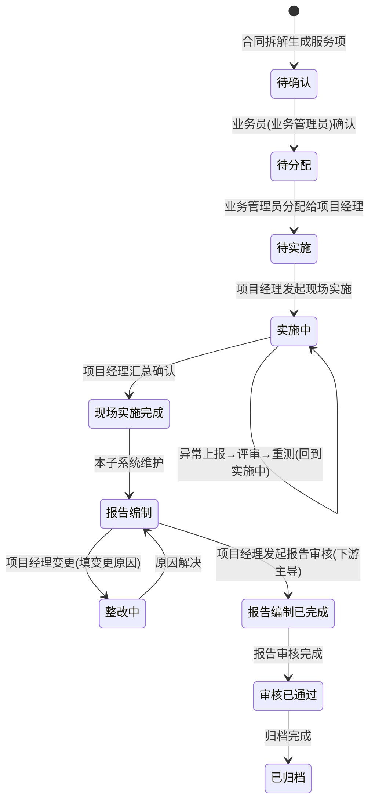

# 项目服务内容管理子系统 需求规格说明书 V1.0

| 文档信息 | 内容 |
| --- | --- |
| 文档名称 | 项目服务内容管理子系统 需求规格说明书 |
| 文档版本 | V1.0 |
| 文档密级 | 内部 |
| 编制日期 | 2026-07-16 |
| 文档状态 | 详细设计稿（待评审） |
| 所属系统 | 测评业务全生命周期管理系统 |
| 上游系统 | 合同管理子系统（合同生效 → 拆解输入） |
| 下游系统 | 报告管理子系统（现场实施完成 → 报告编制）、结算/报销/看板（数据消费） |
| 对应主文档 | 《测评业务全生命周期管理系统需求规格说明书 V1.1》第 3 节 |

> 本文档为**主需求规格说明书第 3 节「项目服务内容管理子系统」的详细展开**，并结合《项目主要节点.txt》中的服务项状态流转规则，将概要需求落地为可评审、可开发、可验收的功能级规格。凡主文档已定义的通用能力（统一认证、字段级访问控制框架、移动端基础能力、流程自动化引擎等），本文档仅做**本子系统视角的引用与细化**，不重复定义全局规范。

---

## 1. 概述

### 1.1 定位与范围

项目服务内容管理子系统承接「合同管理子系统」的输出，是测评业务**项目执行阶段**的核心承载系统。它将生效合同中的服务承诺，转化为可调度、可落地、可追溯的现场执行单元，并贯穿到现场实施完成、进度回传报告管理子系统的全过程。

系统边界内包含三块核心能力：

1. **合同 → 项目拆解**：将合同服务清单结构化为项目主数据与服务项。
2. **资源分配与下达**：将服务项分配至团队、指派项目经理与实施工程师、制定实施计划、完成实施准备。
3. **现场实施管理**：移动端现场作业记录、异常上报与评审闭环、实施完成确认与进度回传。

### 1.2 业务目标（Why）

**解决的核心问题**：在合同生效后到现场实施完成之间，存在一段「承诺→执行」的转化黑盒——服务项靠人工拆、资源靠口头协调、现场记录散落在纸面或微信、进度全靠人肉同步给报告与结算环节。这导致三类损失：

- **交付风险不可见**：服务项是否分配、谁在实施、是否偏离计划，管理层无法实时掌握；
- **资源冲突与合规风险**：人员资质/设备能力与服务项要求不匹配时无人预警，等保/ISO 体系要求的"能力匹配留痕"难以证明；
- **数据断层**：现场原始记录与后续报告编制、结算、归档脱节，报告编制人需反复向实施方要数据，返工率高。

本子系统要解决的是：**让"合同承诺的服务内容"被结构化、被合理分配、被如实记录、被实时同步**，使项目执行从黑盒变为白盒。

### 1.3 在系统中的位置（上下文与状态衔接）

```
[合同管理子系统] --合同生效/服务清单--> [项目服务内容管理子系统] --现场实施完成/进度回传--> [报告管理子系统]
        |                                          |                                                    |
        |                                          |--进度/资源数据--> [数据看板与统计分析子系统]        |
        |                                          |--项目/任务关联--> [报销管理子系统]                  |
        |                                          |--项目/任务关联--> [结算与开票管理子系统]            |
        |                                          |--样品/方法--> [LIMS/检测系统(外部集成)]             |
```

> **状态职责划分**：本子系统**拥有并管理**服务项从「待确认」到「整改中」的完整生命周期（含待确认、待分配、待实施、实施中、现场实施完成、报告编制、整改中）；自「报告编制已完成」起（报告审核、签发、归档）由**报告管理子系统**主导。服务项生成后先进入「待确认」，经业务员（业务管理员）确认方进入「待分配」。各节点状态以**独立字段**分别记录，本子系统与下游通过进度回传同步、互不覆盖。

### 1.4 术语定义

| 术语 | 说明 |
| --- | --- |
| 项目（Project） | 由一份生效合同拆解生成的项目主数据，是执行、报告、结算、归档的顶层聚合单元 |
| 服务项（Service Item） | 项目下最小可执行单元，按"批次/检测类别"分组；是状态机的基本载体 |
| 任务/分配（Assignment） | 将服务项下达至团队负责人、再指派项目经理与实施工程师的过程记录 |
| 现场实施计划（Impl. Plan） | 项目经理制定的执行计划，含时间、人员、设备、渗透测试计划等 |
| 实施记录（Impl. Record） | 实施工程师在现场产生的签到、原始数据、环境、取证照片等留痕 |
| 异常/偏离（Deviation） | 现场发生与计划/标准偏离时上报的单据，需评审闭环 |
| 进度回传（Progress Callback） | 本子系统向报告/看板等环节同步服务项状态变化的机制 |

---

## 2. 业务背景与用户痛点（待解决的典型问题）

> 以下问题源于主文档流程描述与项目节点规则的逻辑推演，**定量基线（如当前拆解耗时、冲突发生率）需在评审前由业务管理员/PMO 提供**；本文档以「[待基线]」标注需补数据的项，避免编造数字。

| # | 痛点 | 影响角色 | 业务后果 |
| --- | --- | --- | --- |
| P1 | 合同服务清单靠人工拆成服务项，无统一分组规则 | 业务管理员 | 拆解口径不一致，下游统计与结算难以对齐 [待基线：平均拆解耗时] |
| P2 | 服务项分配、人员指派靠线下沟通，计划日期无系统约束 | 团队负责人/项目经理 | 资源冲突、逾期不可预警 |
| P3 | 人员资质/设备能力与服务项要求未做系统校验 | 技术总监/项目经理 | 等保/ISO"能力匹配"难举证，合规审计风险 |
| P4 | 现场记录纸面化/微信群化，原始数据易丢失、难追溯 | 实施工程师/报告编制人 | 报告返工、归档材料缺失 |
| P5 | 现场进度、异常靠人肉同步，报告管理环节"等米下锅" | 项目经理/报告编制人 | 报告编制启动滞后，整体交付周期拉长 |
| P6 | 异常（偏离）无标准化上报与评审闭环，处置随意 | 实施工程师/技术总监 | 公正性、可追溯性存疑，不符合 ISO 27001/9001 记录控制 |

---

## 3. 用户角色与职责（本子系统视角）

| 角色 | 在本子系统的核心职责 |
| --- | --- |
| 业务管理员 | 合同→项目拆解、服务项人工调整、任务分配至团队负责人、触发补充协议流程 |
| 团队负责人 | 接收任务、分解并指派项目经理及实施工程师、统筹资源、异常评审（放行/终止/重测） |
| 项目经理 | 制定现场实施计划（含渗透测试计划）、发起实施准备（设备申领/行程）、发起现场实施、汇总确认完成、发起进度回传 |
| 实施工程师 | 移动端签到、填写原始数据与环境、取证拍照上传、异常上报、电子签名 |
| 渗透测试工程师 | 独立流程的渗透测试类服务项执行（见 FR-PJ-3xx 特殊分支） |
| 技术总监 | 人员资质/设备能力主数据维护（Q3）、特殊检测方法复核、异常评审（终止/重测决策）、检测标准方法更新影响评估 |
| 系统管理员 | 规则配置（拆解规则、冲突预警规则、自动化触发）；资质/能力库配置工具支持（主数据归技术总监） |

---

## 4. 服务项全生命周期状态机

### 4.1 状态定义（来源：《项目主要节点.txt》+ 主文档 3.x）

| 状态 | 状态归属 | 进入条件（入口） | 退出条件（出口） | 负责角色 | 进度回传 |
| --- | --- | --- | --- | --- | --- |
| **待确认** | 本子系统 | 服务项生成（合同拆解自动生成或人工新增） | 业务员（业务管理员）确认拆解结果 | 业务员/业务管理员 | 无 |
| **待分配** | 本子系统 | 业务员确认拆解结果后 | 分配给项目经理 | 业务管理员 | 无 |
| **待实施** | 本子系统 | 服务项分配给项目经理 | 项目经理发起现场实施 | 项目经理 | 无 |
| **实施中** | 本子系统 | 项目经理发起现场实施 | 现场实施完成 + 项目经理确认 | 实施工程师/项目经理 | 无 |
| **现场实施完成** | 本子系统 | 项目经理汇总确认现场实施完成 | 进入"报告编制"（本子系统维护） | 项目经理 | 本子系统维护，并通知报告管理 |
| **报告编制** | 本子系统 | 现场实施完成后自动进入 | 项目经理变更为整改中 / 发起报告审核 | 报告编制人/项目经理 | 本子系统维护；同步报告管理 |
| **整改中** | 本子系统 | 项目经理将报告编制变更为整改中（填变更原因） | 原因解决后变更回报告编制 | 项目经理 | 本子系统维护；同步报告管理 |
| **报告编制已完成** | 下游（报告管理） | 项目经理发起报告审核 | 报告审核完成 | 项目经理/报告审核 | 下游回传，本子系统落地该独立字段 |
| **审核已通过** | 下游（报告管理） | 报告审核完成 | 归档完成 | 报告审核人员 | 下游回传，本子系统落地该独立字段 |
| **已归档** | 下游（归档管理） | 归档完成 | 终态 | 归档管理员 | 下游回传，本子系统落地该独立字段 |

### 4.2 状态流转规则

1. **正向主链路**：`待确认 → 待分配 → 待实施 → 实施中 → 现场实施完成 → 报告编制 → 整改中 → 报告编制已完成 → 审核已通过 → 已归档`。其中「待确认→待分配」需业务员人工确认；「报告编制→整改中→报告编制」为本子系统内部的整改回路。
2. **整改回路**（本子系统维护）：`报告编制 ⇄ 整改中`，切换时**必须填写并选择变更原因**，原因解决后方可回到报告编制。该回路状态归属本子系统。
3. **异常回路**（位于实施中阶段，本子系统主导）：`实施中 →（异常上报）异常评审中 → 放行/重测（回到实施中）/ 终止（终止服务项，需留痕并联动合同/结算）`。
4. **状态不可跨级跳变**：除补充协议/终止等显式业务动作外，禁止从「待分配」直接到「实施中」等跳变；所有状态变更需记录操作人、时间、变更前/后值（满足主文档 5. 通用与合规"关键字段变更留痕"）。
5. **进度回传与字段隔离（Q4 已确认）**：每个节点状态使用**独立字段**分别记录（如 field_现场实施完成、field_报告编制已完成…），本子系统维护自有字段，下游状态经回传落地至各自独立字段，互不覆盖、无权威源冲突；任一字段变更均留痕（操作人、时间、前后值）。



---

## 5. 功能需求详述（FR）

> 编号规则：`FR-PJ-<模块><序号>`，模块 1=拆解，2=分配下达，3=现场实施。优先级：P0=必须，P1=重要（可 fast-follow），P2=未来考虑。

### 5.1 合同 → 项目拆解（FR-PJ-1xx）

#### FR-PJ-101 合同生效自动生成项目主数据与服务项（P0）
- **用户故事**：作为业务管理员，我希望合同生效后系统自动依据服务清单生成项目主数据并拆解为独立服务项，以便减少手工拆解、保证口径一致。
- **功能描述**：监听合同管理子系统的「合同生效」事件，读取合同服务清单，按**批次 / 检测类别**二维分组规则自动生成服务项；每个服务项携带来源合同条款引用、系统名称、技术要求摘要。
- **业务规则**：
  - 分组规则可由系统管理员配置（默认：同一批次+同一检测类别 = 1 个服务项；可覆盖）。
  - **检测类别（服务类型）域**参考：等保测评、商用密码应用安全性评估、软件测试、源代码审计、渗透测试、漏洞扫描、APP安全加固、上线测试、安全加固、网络安全风险评估、差距分析、机房检测、网络安全巡检服务、安全培训、安全性测试、应急响应服务、网络安全攻防演练、安全运维（Q1 已确认）。
  - 服务项生成后**不**自动带出「待分配」状态，而是先进入「待确认」；需由业务员（业务管理员）人工确认拆解结果（分组、范围、技术要求）后，方才带出「待分配」状态并进入分配环节。
  - 触发自动化建议（主文档 5.）：自动分配默认团队负责人；若服务项含**特殊检测方法**，自动触发技术总监复核（见 FR-PJ-2xx）。
- **输入**：合同编号、服务清单、生效事件。
- **输出**：项目主数据 1 条 + 服务项 N 条（状态=待确认，待业务员确认后转为待分配）。
- **验收标准**：
  - Given 一份合同生效且含 2 批次×3 类检测类别的检测服务，When 系统接收生效事件，Then 自动生成 1 个项目与对应数量服务项，分组符合配置规则，且服务项生成后状态均为「待确认」（非「待分配」）。
  - Given 业务员（业务管理员）核对拆解结果并确认，When 确认提交，Then 服务项状态由「待确认」变为「待分配」，业务管理员可进行分配。
  - Given 分组规则缺失，When 触发拆解，Then 服务项落入「待确认」并标记"待人工确认"通知业务管理员，而非直接进入待分配或静默失败。

#### FR-PJ-102 服务项人工调整与变更留痕（P0）
- **用户故事**：作为业务管理员，我希望能人工调整拆解结果（合并/拆分/改分组/改归属），以便修正自动拆解偏差并保留审计轨迹。
- **功能描述**：支持对自动生成的服务项做合并、拆分、编辑（场所/批次/类别/计划日期/技术要求），所有调整记录变更前/后值、操作人、时间。
- **业务规则**：
  - 若调整导致**合同服务范围变化**（增项/减项/改量），必须触发**补充协议流程**（复用合同管理子系统流程），未经补充协议不得生效。
  - 仅"范围不变的结构性调整"可不走补充协议，但需备注原因。
- **验收标准**：
  - Given 业务管理员将 2 个服务项合并，When 合并不改变合同总量，Then 生成变更记录且无需补充协议。
  - Given 调整导致某检测类别数量增加，When 提交，Then 系统强制跳转补充协议流程并阻断直接生效。

#### FR-PJ-103 拆解结果可视化与查重（P1）
- **用户故事**：作为业务管理员，我希望一眼看清项目下服务项结构（按场所/批次/类别树状展开），以便核对与汇报。
- **功能描述**：树状/矩阵视图展示服务项分组；支持按合同服务清单逐项勾对，标记"已拆解/未拆解/超范围"。

---

### 5.2 资源分配与下达（FR-PJ-2xx）

#### FR-PJ-201 任务分配至团队负责人（P0）
- **用户故事**：作为业务管理员，我希望把项目/服务项分配给团队负责人，以便进入资源指派环节。
- **功能描述**：业务管理员将项目或服务项集合分配给指定团队负责人；分配后服务项仍为「待分配」直至团队负责人指派项目经理。
- **验收标准**：Given 业务管理员分配 5 个服务项给团队 A，When 提交，Then 团队负责人收到待办，服务项状态仍为待分配但带"已分配团队"标记。

#### FR-PJ-202 指派项目经理与实施工程师 + 计划日期（P0）
- **用户故事**：作为团队负责人，我希望将服务项指派给项目经理和实施工程师并设定计划日期，以便明确责任与节点。
- **功能描述**：团队负责人为每个服务项（或批量）指派项目经理、实施工程师（可多人），填写计划开始/结束日期。指派完成即服务项进入「待实施」。
- **业务规则**：
  - 计划日期不得早于合同交付下限（可配置校验规则）。
  - 支持批量指派与模板套用（同类服务项复用人员/计划）。
- **验收标准**：
  - Given 团队负责人完成指派，When 保存，Then 服务项状态由待分配→待实施，项目经理/实施工程师收到待办。

#### FR-PJ-203 现场实施计划制定（含渗透测试计划）（P0）
- **用户故事**：作为项目经理，我希望制定现场实施计划（时间、路线、人员、设备、渗透测试计划），以便现场有序执行。
- **功能描述**：项目经理基于服务项创建实施计划，关联实施工程师、设备、行程；渗透测试类服务项需单独编制渗透测试计划（范围、授权边界、时间窗）。
- **验收标准**：Given 某服务项标记为渗透测试类，When 项目经理制定计划，Then 系统强制要求填写渗透测试授权边界与范围，否则不可发起实施。

#### FR-PJ-204 人员资质 / 设备能力管理（P0）
- **用户故事**：作为技术总监，我希望维护人员资质与设备能力库（对应等保/ISO 等不同体系要求），以便系统能校验匹配。
- **功能描述**：维护资质/能力主数据（人员资质类型、等级、有效期；设备能力类型、精度、检定有效期），与体系要求（等保/ISO 9001/ISO 27001）关联。**主数据维护责任归属技术总监**（系统管理员仅提供配置工具支持，Q3 已确认）。
- **验收标准**：Given 某资质有效期过期，When 被用于服务项匹配，Then 标记为无效并预警。

#### FR-PJ-205 服务项—资质/能力匹配校验与冲突预警（P0）
- **用户故事**：作为项目经理/技术总监，我希望系统在指派时自动校验"服务项要求 ⇄ 人员资质/设备能力"，以便提前发现不匹配与冲突。
- **功能描述**：基于服务项的技术要求（检测类别、体系、精度等，含「特殊检测方法」标记）与候选人员资质、设备能力做匹配；对**资质不满足、设备冲突（同一设备同时间窗被多服务项占用）、人员冲突（同一人同时间窗多任务）**给出冲突预警。注：「特殊检测方法」为**手动标记**（业务管理员拆解时 / 团队负责人或项目经理指派时勾选，无系统判定清单，见 FR-PJ-207 与 Q2）。
- **业务规则**：
  - 冲突级别：阻断（资质硬不满足）/ 警告（时间窗重叠建议调剂）。
  - 预警结果可"带原因强制通过"（需上级审批留痕）。
- **验收标准**：
  - Given 服务项 A 要求等保资质且无资质人员被指派，When 保存，Then 阻断并提示缺失资质类型。
  - Given 设备 X 在 T 时段已被服务项 A 占用，When 服务项 B 同段指派设备 X，Then 弹出冲突预警。

#### FR-PJ-206 实施准备：设备申领与行程预定（P1）
- **用户故事**：作为项目经理，我希望在实施前发起设备申领与人员行程预定，以便现场资源到位。
- **功能描述**：关联 FR-PJ-204 设备库发起申领；支持项目人员行程的**内部登记**（时间、地点、人员）。**本期不对接外部差旅/日程系统**（Q7 已确认），行程仅内部记录，用于后续报销比对（主文档 5. 报销阶段规则）。

#### FR-PJ-207 特殊检测方法标记并触发技术总监复核（P0，自动化）
- **用户故事**：作为技术总监，我希望被标记为特殊检测方法的服务项在拆解/指派时自动进入我的复核，以便把控技术可行性。
- **功能描述**：「特殊检测方法」**无系统判定清单**，由业务管理员（拆解时）、团队负责人或项目经理（指派时）**手动标记**；标记后自动生成技术总监复核待办，复核通过方可进入实施中（Q2 已确认）。
- **验收标准**：Given 服务项被手动标记为特殊方法，When 项目经理发起现场实施，Then 未过技术总监复核则阻断并提示。

---

### 5.3 现场实施管理（FR-PJ-3xx）

#### FR-PJ-301 移动端现场签到（P0）
- **用户故事**：作为实施工程师，我希望到现场用 APP 签到（GPS+时间戳），以便证明到场与时效。
- **功能描述**：实施工程师在计划开始日于现场范围内 APP 签到，记录 GPS 坐标、时间戳；支持离线签到，有网自动同步。
- **业务规则**：
  - 自动化建议：现场实施计划开始当天未签到，自动提醒项目经理和实施工程师。
  - 签到 GPS 与计划场所偏差超阈值（可配置）时提示确认。
- **验收标准**：
  - Given 计划开始日，When 实施工程师在场所 50m 内签到，Then 记录成功并标记"已签到"。
  - Given 偏离场所 1km 签到，When 提交，Then 弹偏差提示需说明原因。

#### FR-PJ-302 原始数据 / 环境条件填写与取证拍照（P0）
- **用户故事**：作为实施工程师，我希望在现场填写原始数据、环境条件并拍照取证上传，以便数据真实可追溯。
- **功能描述**：结构化表单录入原始数据（按检测类别模板）、环境条件（温湿度等），拍照标注上传（带时间戳）；支持离线填写，有网提交。（注：离线拍照的**合规水印细则**本期不实施，见 Non-Goals 第 7 条 / Q6）
- **验收标准**：Given 实施工程师提交记录，When 含必填原始数据缺失，Then 阻断提交并高亮缺失项。

#### FR-PJ-303 电子签名（P0）
- **用户故事**：作为实施工程师，我希望对现场记录电子签名，以便确认数据真实性（满足记录控制）。
- **功能描述**：记录提交前实施工程师电子签名；签名与时间戳绑定，不可篡改（留痕）。（注：离线场景电子签名的**合规细则**本期不实施，见 Non-Goals 第 7 条 / Q6；本期提供基础电子签名与留痕）

#### FR-PJ-304 异常（偏离）上报与评审闭环（P0）
- **用户故事**：作为实施工程师，我希望发生偏离时停止任务并上报，以便团队负责人/技术总监评审决定放行/终止/重测。
- **功能描述**：实施工程师上报异常（类型、描述、证据），任务进入异常评审；团队负责人/技术总监评审给出**放行 / 终止 / 重测**结论，全程留痕。
  - 放行：回到实施中继续。
  - 重测：回到实施中重新执行。
  - 终止：服务项终止，需填写终止原因并联动合同/结算（范围变化）。
- **验收标准**：
  - Given 实施工程师上报偏离，When 提交，Then 任务挂起且评审人收到待办，期间不可继续填报。
  - Given 评审结论=终止，When 确认，Then 服务项标记终止并触发合同补充协议/结算联动待办。

#### FR-PJ-305 渗透测试工程师独立流程（P1）
- **用户故事**：作为渗透测试工程师，我希望走独立审批/授权流程执行渗透类服务项，以便符合授权边界与合规。
- **功能描述**：渗透测试类服务项强制独立流程（授权书校验、范围锁定、过程留痕），不与常规实施混同。

#### FR-PJ-306 现场实施完成确认与进度回传（P0）
- **用户故事**：作为项目经理，我希望汇总确认现场实施完成，以便将状态推进至报告编制并通知下游。
- **功能描述**：项目经理核对实施记录完整性后，将服务项置为「现场实施完成」；系统通过**进度回传接口**通知报告管理子系统进入「报告编制」，并关联合约原始记录。
- **验收标准**：
  - Given 所有实施记录齐备且签名完成，When 项目经理确认完成，Then 服务项=现场实施完成，且报告管理子系统收到"报告编制"入口待办。
  - Given 实施记录缺失，When 项目经理尝试确认，Then 提示缺失项并建议补交（不强制阻断，但留痕）。

#### FR-PJ-307 检测标准方法更新影响评估（P1，自动化）
- **用户描述**：检测标准方法更新时，系统自动识别受影响服务项并通知技术总监评估。
- **验收标准**：Given 某标准方法版本更新，When 系统匹配到在途服务项引用旧版，Then 自动通知技术总监并标记"待评估"。

---

## 6. 字段级权限与数据安全（本子系统细化）

引用主文档 2.4 框架，本子系统落地的字段级规则：

| 角色 | 可见 | 不可见/脱敏 |
| --- | --- | --- |
| 销售/客户经理 | 客户、服务内容、项目状态 | 成本价、实施人员资质明细 |
| 业务管理员 | 全字段（含合同金额引用） | — |
| 团队负责人 | 服务范围、人员、计划、资源 | 合同金额、成本价 |
| 项目经理 | 服务范围、交付日期、实施记录 | 合同金额、成本价 |
| 实施工程师 | 本人负责的服务项实施相关内容 | 商务条款、金额 |
| 技术总监 | 技术要求、方法、资质/能力 | 商务条款、金额 |
| 财务 | 项目/任务关联（用于结算） | 技术细节、原始数据内容 |
| 系统管理员 | 配置与日志 | 业务数据明文（按需审计） |

- 通过「角色—数据权限规则」动态脱敏或明文，关键字段（金额、成本价）默认脱敏，按角色提升可见性。
- 所有字段级访问与变更进入审计日志（满足等保/ISO 27001 记录控制）。

---

## 7. 非功能性需求（本子系统相关）

| 类别 | 要求 |
| --- | --- |
| 移动端 | 实施工程师 APP：GPS 签到、离线记录、拍照标注、电子签名；有网自动提交；iOS/Android 主流机型适配；PC↔移动无缝切换 |
| 易用性 | 拆解/指派关键步骤分步引导；表单自动填充已知字段（合同/客户信息）；全局模糊搜索（项目号/客户/服务项）；列表高级筛选+自定义列；批量指派/批量确认 |
| 安全性 | 满足等级保护合规；电子签名防篡改；现场照片带时间戳水印；敏感字段脱敏 |
| 可集成性 | RESTful/WebService：接收合同生效事件（上游）、回传进度/服务项状态（下游报告管理）、推送资源/进度至看板、关联项目至报销/结算、样品/方法对接 LIMS（若集成）；统一认证 LDAP/AD/OAuth2/SAML + 钉钉/企微组织同步 |
| 性能 | 单项目千级服务项下列表筛选 < 2s；移动端离线提交同步成功率 ≥ 99%；进度回传接口 P99 < 500ms |
| 可用性 | 关键现场作业链路（签到/记录/签名）在弱网/离线可完成，恢复后自动补传 |

---

## 8. 数据实体与关键字段（概要）

| 实体 | 关键字段 | 说明 |
| --- | --- | --- |
| 项目 Project | 项目ID、合同编号、客户、状态、创建人 | 由合同拆解生成 |
| 服务项 ServiceItem | 服务项ID、项目ID、场所、批次、检测类别、体系要求、计划日期、状态、技术要求、来源条款 | 状态机载体 |
| 任务分配 Assignment | 分配ID、服务项ID、团队负责人、项目经理、实施工程师、计划日期、分配时间 | 资源下达记录 |
| 实施计划 ImplPlan | 计划ID、服务项ID、人员、设备、行程、渗透测试计划(授权边界/范围) | 含特殊分支 |
| 实施记录 ImplRecord | 记录ID、服务项ID、签到GPS/时间、原始数据、环境、照片、电子签名 | 现场留痕 |
| 异常单 Deviation | 异常ID、服务项ID、类型、描述、证据、评审结论(放行/重测/终止)、评审人 | 闭环留痕 |
| 资源-资质 Resource | 人员/设备ID、资质类型、等级、有效期、关联体系 | 匹配校验源 |

> 实体间关系：Project 1—N ServiceItem；ServiceItem 1—1 Assignment；ServiceItem 1—1 ImplPlan；ServiceItem 1—N ImplRecord；ServiceItem 1—N Deviation。

---

## 9. 接口与集成需求

| 接口 | 方向 | 消费方/提供方 | 内容 |
| --- | --- | --- | --- |
| 合同生效事件 | 入 | 合同管理 → 本系统 | 合同编号、服务清单、生效标志（触发 FR-PJ-101） |
| 补充协议回写 | 出→入 | 本系统 ↔ 合同管理 | 范围变更触发补充协议，结果回写服务项 |
| 进度回传（现场实施完成→报告编制） | 出 | 本系统 → 报告管理 | 服务项ID、field_现场实施完成=true、进入本系统「报告编制」状态、关联原始记录 |
| 进度回传（报告编制已完成/审核已通过/已归档） | 入 | 报告管理 → 本系统 | 各节点状态以**独立字段**分别回传（field_报告编制已完成 等），分别落地、互不覆盖（Q4） |
| 资源/进度数据 | 出 | 本系统 → 数据看板 | 状态分布、准时率、人员/设备利用率 |
| 项目/任务关联 | 出 | 本系统 → 报销/结算 | 项目ID、任务ID（用于预算/应收关联） |
| 样品/方法 | 出/入 | 本系统 ↔ LIMS | 样品编号关联、检测方法版本（若集成） |
| 组织/权限 | 入 | 统一认证/IM | 人员、角色、权限映射；待办推送企微/钉钉 |

---

## 10. 成功指标（Metrics）

> 北极星与驱动指标由本子系统拥有；健康指标监控质量与风险。**所有基线值标注 [待基线]，需在系统上线前由 PMO 采集 4–8 周历史数据确定。**

### 北极星指标
- **服务项"现场实施完成"准时交付率** = 按计划日期完成现场实施的服务项数 / 应完成服务项数。
  - 目标（假设）：上线 1 季度后 ≥ 85%（成功阈值）/ ≥ 92%（冲刺）；基线 [待基线]。

### 驱动指标（Leading）
| 指标 | 定义 | 目标（假设） |
| --- | --- | --- |
| 合同→项目拆解自动化率 | 自动生成服务项 / 总服务项 | ≥ 90% |
| 资源下达及时率 | 待分配→待实施 在 SLA(如 2 工作日) 内占比 | ≥ 95% |
| 现场签到率 | 计划开始日签到服务项 / 应签到 | ≥ 98% |
| 异常闭环时长 | 上报→评审结论 median | ≤ 1 工作日 |
| 进度回传准确率 | 各节点状态独立字段与实际一致率（独立字段记录，无覆盖冲突，Q4） | 100%（不一致即告警） |

> 注：各状态 SLA 量化目标（如待分配→待实施 时限）待 Q5 最终确认，本期先按流程顺畅度观测，不预设硬阈值。

### 健康指标（Lagging / 质量）
| 指标 | 定义 | 目标 |
| --- | --- | --- |
| 实施记录完整率 | 含 GPS/时间戳/照片/签名的记录占比 | ≥ 99% |
| 资质/能力冲突拦截数 | 系统阻断的不匹配指派次数 | 监控（非零即有效） |
| 离线提交成功率 | 移动端离线→同步成功占比 | ≥ 99% |
| 字段级越权访问拦截 | 脱敏字段被越权访问尝试 | 记录并清零异常 |

### 评估节奏
- 上线 1 周：验证驱动指标埋点正确、回传链路通畅。
- 上线 1 月：首次北极星读数，对比 [待基线]。
- 上线 1 季度：判定是否达成功阈值，决定 P1 功能优先级。

---

## 11. 非目标（Non-Goals）

1. **不实现报告的实际编制 / 审核 / 签发 / 归档操作**：「报告编制」与「整改中」的**状态归属本子系统**（本子系统维护其状态流转与进度），但报告的在线协同编制、AI/人工审核、授权签字、物理装订与归档等操作由报告管理子系统承载；自「报告编制已完成」起由报告管理子系统主导。
2. **不实现合同起草与审批**：合同创建、审批、签署归合同管理子系统；本系统只在合同生效后介入。
3. **不实现报销与结算计算**：仅提供项目/任务关联锚点，报销单与应收计算在各自子系统。
4. **不实现客户自助门户**：客户进度查看/异议在客户与商机管理子系统的门户模块。
5. **不在本期做 AI 自动拆解**：本期拆解规则为可配置结构化规则，AI 语义拆解列为 P2 未来考虑。
6. **不替代 LIMS 检测能力**：仅做样品/方法关联与数据引用，检测执行在 LIMS/专业系统。
7. **本期不实现离线电子签名与照片水印的合规细则**（Q6）：提供基础电子签名与留痕、照片带时间戳，但离线场景的合规水印/签名法律细则待定，列为后续。
8. **本期不对接外部差旅/行程系统**（Q7）：行程仅内部登记，不与外部差旅系统打通。

---

## 12. 风险与待确认事项（Open Questions）

| # | 问题（摘要） | 状态 | 回复结论与文档采纳 |
| --- | --- | --- | --- |
| Q1 | 服务项分组业务口径 | 已回复 | 提供 19 类服务类型域（等保测评…安全运维）；已写入 FR-PJ-101「检测类别」域 |
| Q2 | 特殊检测方法判定清单 | 已回复 | 无判定清单，依赖业务管理员/团队负责人/项目经理手动标记；已更新 FR-PJ-205/207 |
| Q3 | 资质/能力主数据归属 | 已回复 | 归技术总监维护；已更新 FR-PJ-204 与第 3 节角色 |
| Q4 | 进度回传字段契约/冲突 | 已回复 | 各节点状态用独立字段分别记录，无覆盖冲突；已更新 4.2 规则 5 与第 9 节 |
| Q5 | 各状态 SLA 量化目标 | 待定 | 继续推进；指标基线暂标注[待基线]，见第 10 节 |
| Q6 | 离线签名/水印合规细则 | 已回复（本期不实施） | 本期不实现；已写入 Non-Goals 第 7 条，FR-PJ-302/303 标注 |
| Q7 | 差旅系统对接 | 已回复（不对接） | 本期不对接；FR-PJ-206 改为内部行程登记，已写入 Non-Goals 第 8 条 |

---

## 附录 A：用户故事清单（汇总）

- 业务管理员：合同生效自动拆解；人工调整并留痕；触发补充协议；分配至团队负责人。
- 团队负责人：指派项目经理/实施工程师与计划；异常评审（放行/重测/终止）。
- 项目经理：制定实施计划（含渗透）；发起实施准备；发起现场实施；确认完成与回传；发起整改变更。
- 实施工程师：移动端签到；填写原始数据/环境/拍照；电子签名；异常上报。
- 渗透测试工程师：独立授权流程执行。
- 技术总监：特殊方法复核；异常终止/重测决策；标准方法更新影响评估。
- 系统管理员：资质/能力库维护；拆解与冲突规则配置；自动化触发配置。

## 附录 B：验收检查单（概要）

- [ ] 合同生效自动拆解且分组符合规则
- [ ] 范围变更强制补充协议
- [ ] 指派触发待实施且待办可达
- [ ] 资质/设备/人员冲突预警正确
- [ ] 移动端签到/记录/签名离线可用
- [ ] 异常上报→评审→闭环留痕完整
- [ ] 现场实施完成正确回传报告编制
- [ ] 下游状态（整改/审核/归档）正确落地
- [ ] 字段级权限按角色脱敏正确
- [ ] 审计日志记录关键变更
